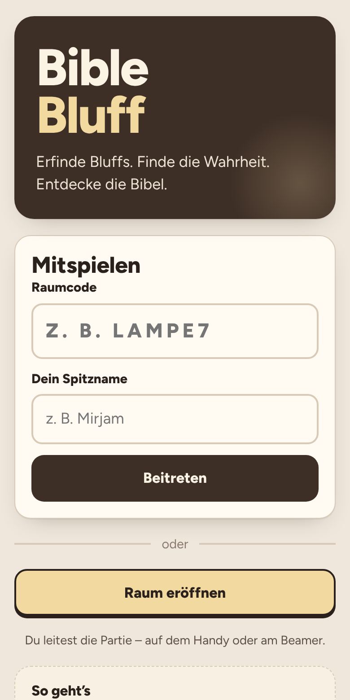
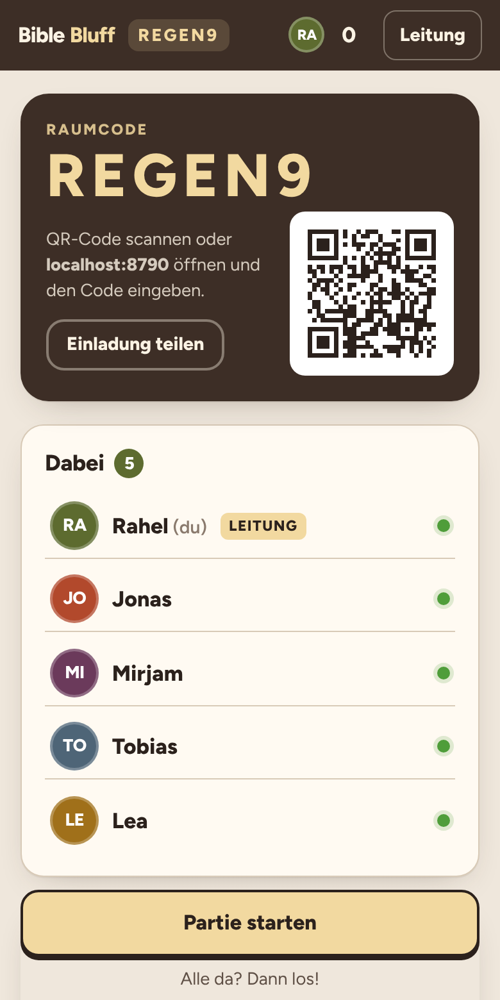
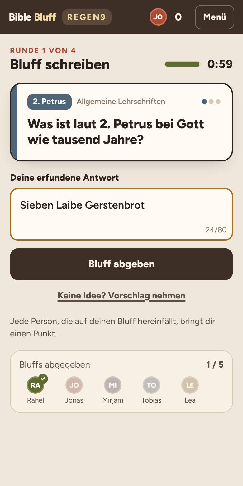
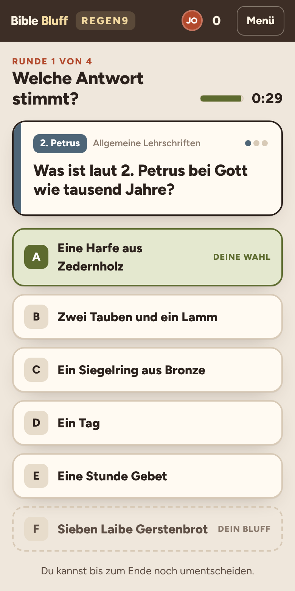
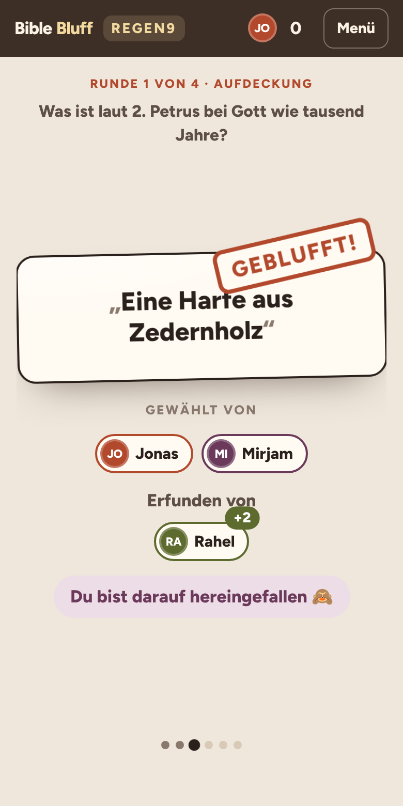
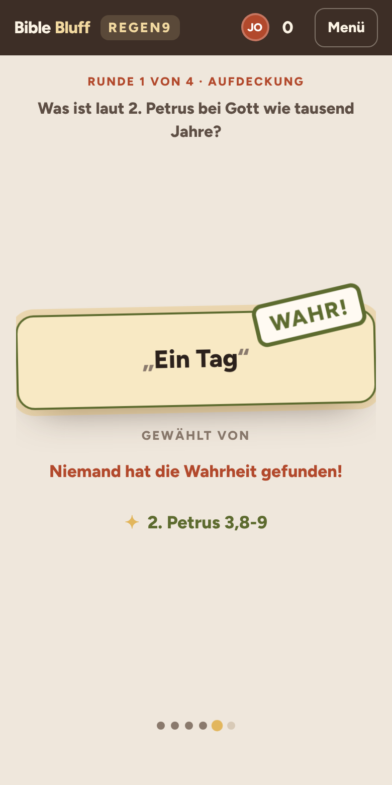
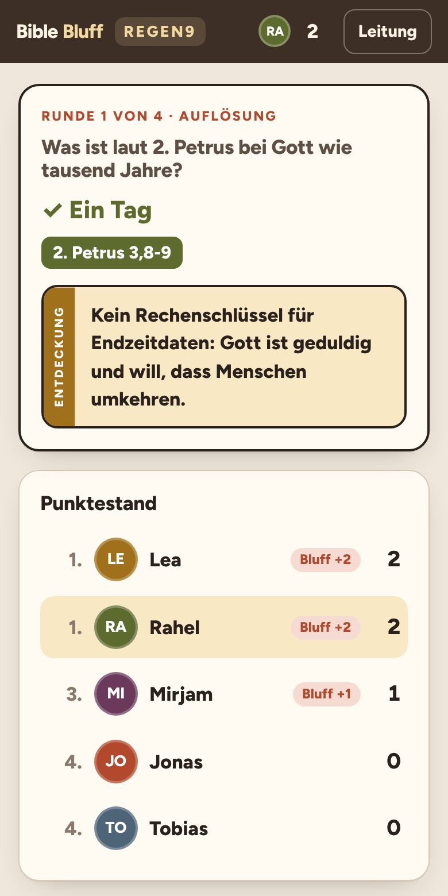
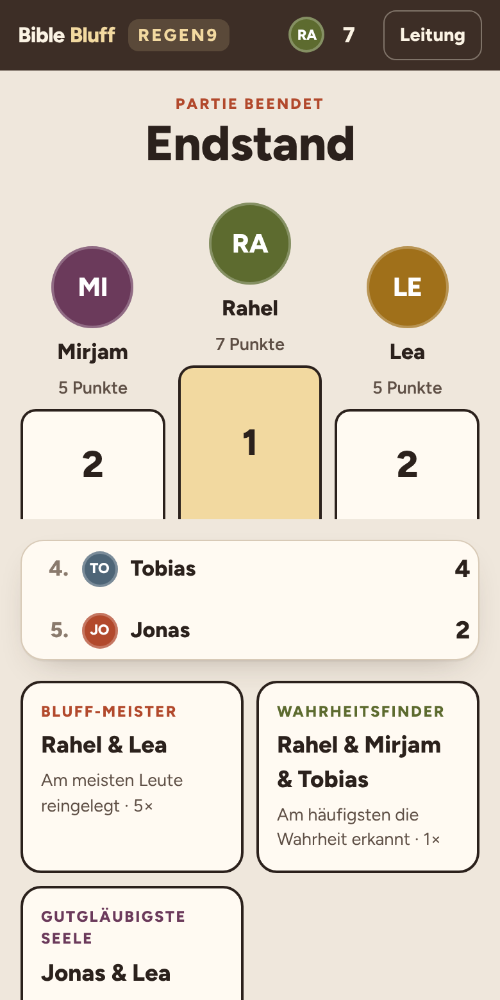
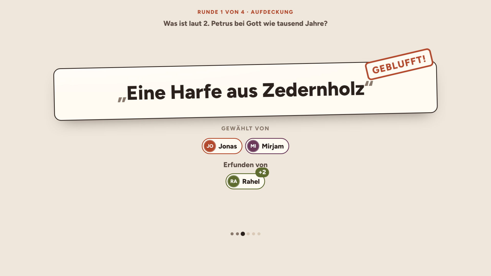

# Bible Bluff

**Erfinde Bluffs. Finde die Wahrheit. Entdecke die Bibel.**

Bible Bluff ist ein Partyspiel für den Browser: Jede Person spielt auf dem eigenen Handy, ein Fernseher oder Beamer kann zusätzlich die gemeinsame Ansicht zeigen. Alle sehen dieselbe Bibelfrage und erfinden heimlich eine glaubwürdige, aber falsche Antwort. Danach steht die echte Antwort anonym zwischen den Bluffs, und alle tippen auf die vermeintlich richtige. Bei der Aufdeckung zeigt sich, wer worauf hereingefallen ist und was wirklich stimmt.

Die Fragen stammen aus dem *Studienkonzept NT* (Lernblätter zu allen 27 Büchern des Neuen Testaments, freikirchlich-pfingstliche Lernfassung). Der Pool umfasst 118 kuratierte Fragen mit Bibelstelle und einer kurzen Entdeckung.

| Start | Lobby | Bluff schreiben | Abstimmen |
| --- | --- | --- | --- |
|  |  |  |  |

| Aufdeckung: Bluff | Aufdeckung: Wahrheit | Punkte & Entdeckung | Endstand |
| --- | --- | --- | --- |
|  |  |  |  |

Leinwand-Ansicht (`/tv/RAUMCODE`):



## So läuft eine Partie

1. **Raum eröffnen.** Die Spielleitung wählt Rundenzahl (4–12, Standard 8), Schwierigkeit (leicht, mittel, schwer, gemischt) und die Zeitlimits. Sie spielt mit oder leitet nur, etwa am Beamer.
2. **Beitreten.** Alle scannen den QR-Code oder geben den Raumcode (z. B. `LAMPE7`) und einen Spitznamen ein. Konten gibt es nicht.
3. **Gemeinsam starten.** Dieselbe Runde beginnt auf allen Handys.

| Phase | Was passiert |
| --- | --- |
| Bluff schreiben (45–120 s) | Alle erfinden heimlich eine falsche Antwort. Wer keine Idee hat, nimmt einen vorbereiteten Vorschlag. |
| Abstimmen (20–60 s) | Die Wahrheit steht anonym und gemischt zwischen den Bluffs. Den eigenen Bluff kann man nicht wählen. |
| Aufdecken | Synchron auf allen Geräten: Wer hat was gewählt? Wer hat es erfunden? Am Ende kommt der Stempel „Wahr!“. |
| Punkte & Entdeckung | Die Bibelstelle, ein überraschender Satz zur Auflösung und der Punktestand. |

**Punkte:** +2 für das Erkennen der richtigen Antwort, +1 für jede Person, die auf den eigenen Bluff hereinfällt.

Dadurch kann auch jemand mit wenig Bibelwissen gewinnen, denn gute Einfälle und Menschenkenntnis zählen mit. Am Ende gibt es ein Siegertreppchen und drei Auszeichnungen (Bluff-Meister, Wahrheitsfinder, Gutgläubigste Seele). Außerdem zeigt der Endstand alle Entdeckungen der Partie zum Nachlesen.

### Faire Runden

- **Versehentlich richtige Bluffs** werden abgelehnt („zu nah an der Wahrheit“). Jede Frage hat dafür hinterlegte Schlüsselwörter und Antwortvarianten, dazu kommt ein unscharfer Textvergleich. Zahlen werden dabei nicht verwechselt (400 ≠ 430).
- **Gleiche Bluffs** werden zusammengeführt, unabhängig von Groß- und Kleinschreibung, Füllwörtern, Wortreihenfolge und kleinen Tippfehlern. Fallen andere darauf herein, bekommen alle Urheber ihre Punkte.
- **Wenige Bluffs?** Dann füllt das Spiel mit vorbereiteten „Hausbluffs“ auf, damit immer mindestens vier Antworten zur Wahl stehen.
- **Geheimnisse bleiben auf dem Server.** Die richtige Antwort, die Urheber der Bluffs und die Stimmen gelangen erst mit der Aufdeckung zu den Handys. Die Fragen liegen nicht im Browser-Code.

### Für die Spielleitung

Das Menü „Leitung“ bietet:
- Pausieren und Fortsetzen (alle Zeitlimits stehen still)
- eine Phase vorzeitig beenden
- eine Frage tauschen oder die Aufdeckung beschleunigen
- den Raum für Neue sperren
- Teilnehmende entfernen
- die Spielleitung übergeben
- den Raum schließen

Ist die Spielleitung länger als 90 Sekunden nicht erreichbar, übernimmt automatisch die Person, die am längsten dabei ist. Die Punkte-Phase läuft nach 40 Sekunden von selbst weiter.

### Verbindungsabbrüche

Jedes Handy merkt sich seine Sitzung. Neu laden, kurz das WLAN verlieren oder den Bildschirm sperren kostet nichts. Wer das Gerät oder den Browser wechselt, gibt einfach denselben Spitznamen wieder ein und steigt am alten Platz wieder ein, solange das alte Gerät nicht mehr verbunden ist. Während der Partie bleibt der Bildschirm wach, sofern der Browser das unterstützt. Ein fertiger, aber noch nicht abgeschickter Bluff wird kurz vor Ablauf der Zeit automatisch abgegeben.

## Loslegen

Voraussetzung ist Node.js 20 oder neuer.

```bash
npm install
npm run dev          # http://localhost:5173 – App mit eingebauter API (Räume im Arbeitsspeicher)
```

### Spieleabend ohne Cloud (eigenes WLAN)

```bash
npm run build
npm start            # zeigt die Adresse im WLAN an, z. B. http://192.168.0.23:8787
```

Alle Handys im selben WLAN öffnen diese Adresse. Am besten eröffnet die Spielleitung den Raum über die WLAN-Adresse, dann zeigt auch der QR-Code dorthin. Die Räume liegen im Arbeitsspeicher und verschwinden beim Beenden.

### Veröffentlichen auf Cloudflare (Workers + D1)

```bash
npx wrangler login
npx wrangler d1 create bible-bluff        # die ausgegebene database_id in wrangler.toml eintragen
npm run db:migrate:remote                 # Tabellen anlegen
npm run deploy                            # baut die App und veröffentlicht Worker + Assets
```

Lokal lässt sich der echte Worker mit D1 so testen: `npm run dev:cf` (Port 8787).

## Technik

```
Handys / Leinwand ──(etwa jede Sekunde: GET /api/rooms/CODE)──▶ Cloudflare Worker ──▶ D1
                  ◀── persönliche, gefilterte Sicht ──────────┘   rooms (JSON + Version)
                  ──(POST /api/rooms/CODE/action)─────────────▶   presence (zuletzt gesehen)
```

- **Server entscheidet alles.** Zeitlimits, Phasenwechsel, Duplikat-Erkennung und Punkte werden zentral berechnet. Phasen schalten „im Vorbeigehen“ weiter, also bei der nächsten Anfrage nach Ablauf der Frist oder sobald alle Verbundenen abgegeben haben. So braucht es weder Cron noch Dauerprozess.
- **Optimistische Sperre.** Der Raumzustand liegt als JSON mit Versionsnummer in D1. Ein Update gilt nur, wenn niemand dazwischen geschrieben hat; sonst wird neu gelesen und wiederholt. Getestet ist das mit zwölf gleichzeitigen Abgaben gegen lokale D1.
- **Synchrone Aufdeckung.** Der Server legt Ablauf und Startzeit fest. Jedes Gerät gleicht seine Uhr mit dem Server ab und rechnet den aktuellen Schritt selbst aus. Darum stehen alle Handys im selben Moment beim selben Bluff.
- **Präsenz** wird gedrosselt in einer eigenen Tabelle festgehalten (höchstens alle 5 s pro Gerät). Sie bestimmt, auf wen gewartet wird und wer die Leitung übernehmen kann.
- **Spiel-Engine als reine Funktionen** (`src/server/engine.ts`): Zeit, Zufall und Präsenz kommen von außen. Das macht sie vollständig testbar. Dieselbe API läuft im Worker, im Vite-Dev-Server und im lokalen Node-Server.
- **Frontend:** Preact und Vite, etwa 25 kB JavaScript (gzip). Die Schrift Figtree ist selbst gehostet, es gibt keine externen Dienste und keine Cookies. Das Design ist an die Lernblätter angelehnt: Papier, Dunkelbraun, Gold und die Farben der Buchgruppen.

### Kosten und Grenzen

Eine Partie mit 12 Handys erzeugt rund 40 000 Anfragen pro Stunde (in der Lobby und während der Aufdeckung weniger). Der kostenlose Workers-Tarif erlaubt 100 000 Anfragen pro Tag, also gut zwei Stunden Spiel mit voller Besetzung. Für regelmäßige Spieleabende empfiehlt sich Workers Paid (5 $/Monat, 10 Mio. Anfragen) oder der lokale Server. Die Preise bitte vor der Entscheidung in der aktuellen Cloudflare-Preisliste prüfen. Als nächster Ausbauschritt bieten sich Durable Objects mit WebSockets an: Sie ersetzen das Abfragen und senken die Last deutlich.

Räume werden 24 Stunden nach der letzten Änderung gelöscht.

## Fragen ergänzen

Die Fragen stehen in `src/server/questions.ts`. Jede Frage hat folgende Felder:

```ts
{
  id: '2tim-mantel',
  book: '2. Timotheus',
  group: 'pastoral',                 // Farbe der Buchgruppe
  difficulty: 2,                     // 1 leicht · 2 mittel · 3 schwer
  prompt: 'Was sollte Timotheus Paulus mitbringen?',
  answer: 'Einen Mantel, Bücher und Pergamente',     // im Stil eines Bluffs: kurz, ohne Klammern
  accept: [['mantel'], ['pergament'], ['*buecher']], // Schlüsselwörter für „zu nah an der Wahrheit“
  bluffs: ['Brot, Öl und neue Sandalen', /* … */],    // Vorschläge und Hausbluffs
  ref: '2. Timotheus 4,13',
  discovery: 'Auch Paulus brauchte warme Kleidung und Lesestoff. …',
}
```

Schlüsselwörter werden ohne Umlaute geschrieben (`ae`, `oe`, `ue`, `ss`). Ein Wort ohne Zeichen muss am Wortanfang passen, `*wort` darf irgendwo im Wort stehen, `=wort` muss genau so lauten. Mehrere Wörter in einer Gruppe müssen alle vorkommen. Die Tests prüfen jede Frage automatisch: Die Antwort selbst muss erkannt werden, die vorbereiteten Bluffs dürfen nicht anschlagen.

## Tests

```bash
npm run typecheck
npm test             # Engine, Textvergleich, Fragenpool, API (Vitest)
npm run test:e2e     # komplette Partien mit mehreren Browsern (Playwright)
```

## Projektstruktur

```
src/
  shared/      Typen und Regeln, die Server und Browser teilen
  server/      Engine, Fragenpool, Textvergleich, API, D1-/Speicher-Anbindung
  worker.ts    Cloudflare-Worker-Einstieg
  client/      Preact-App (Startseite, Lobby, Phasen, Aufdeckung, Leinwand)
migrations/    D1-Schema
scripts/       lokaler Node-Server
tests/ e2e/    Unit- und End-to-End-Tests
```
