<p align="center"></p>

# Bible Bluff

**Erfinde Bluffs. Finde die Wahrheit. Entdecke die Bibel.**

Bible Bluff ist ein Partyspiel für den Browser: Jede Person spielt auf dem eigenen Handy, ein Fernseher oder Beamer kann zusätzlich die gemeinsame Ansicht zeigen. Alle sehen dieselbe Bibelfrage und erfinden heimlich eine glaubwürdige, aber falsche Antwort. Danach steht die echte Antwort anonym zwischen den Bluffs, und alle tippen auf die vermeintlich richtige. Bei der Aufdeckung zeigt sich, wer worauf hereingefallen ist und was wirklich stimmt.

Die Fragen stammen aus dem *Studienkonzept NT* (Lernblätter zu allen 27 Büchern des Neuen Testaments, freikirchlich-pfingstliche Lernfassung). Dazu kommen geprüfte Fragen aus einem eigenen Fragenpool, auch zu ausgewählten Geschichten des Alten Testaments. Hinzu kommen die in der Fragenwerkstatt freigegebenen Fragen, darunter 30 zu Jesu Botschaft. Der Pool umfasst 186 kuratierte Fragen mit Bibelstelle und einer kurzen Entdeckung.

| Start | Lobby | Bluff schreiben | Abstimmen |
| --- | --- | --- | --- |
|  |  |  |  |

| Aufdeckung: Bluff | Aufdeckung: Wahrheit | Punkte & Entdeckung | Endstand |
| --- | --- | --- | --- |
|  |  |  |  |

| Lieblingsbluff | Bester Bluff des Abends | Entdeckungen teilen | Entdeckungen zum Mitnehmen |
| --- | --- | --- | --- |
| 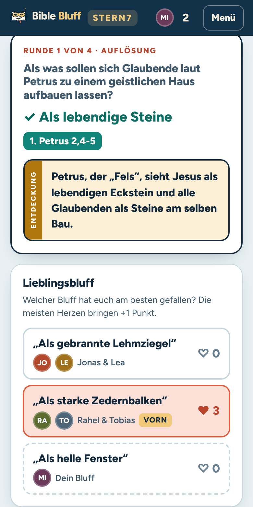 | 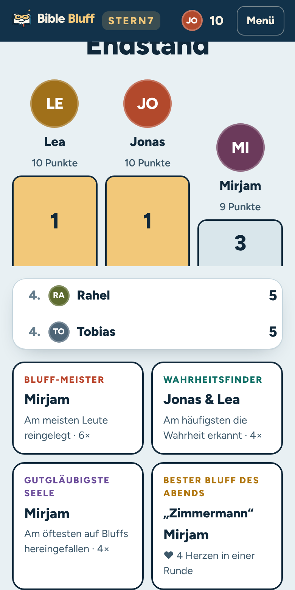 | 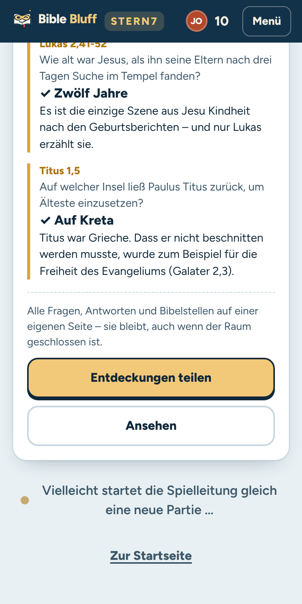 | 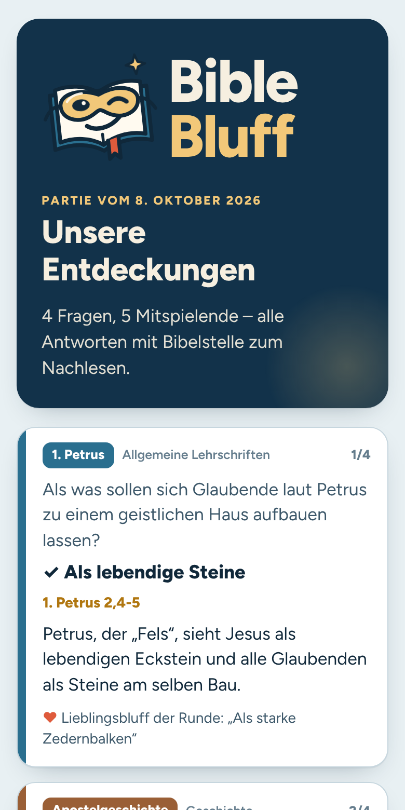 |

| Spickzettel der Leitung | Vom Spiel ins Gespräch | Liebe deinen Nächsten | Ruhige Minute |
| --- | --- | --- | --- |
| 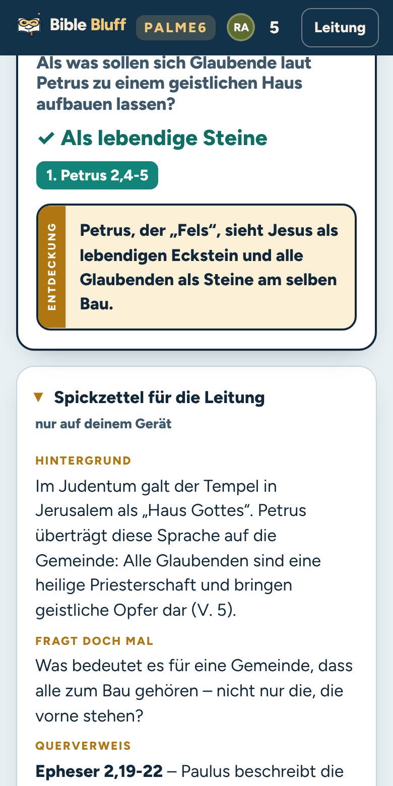 | 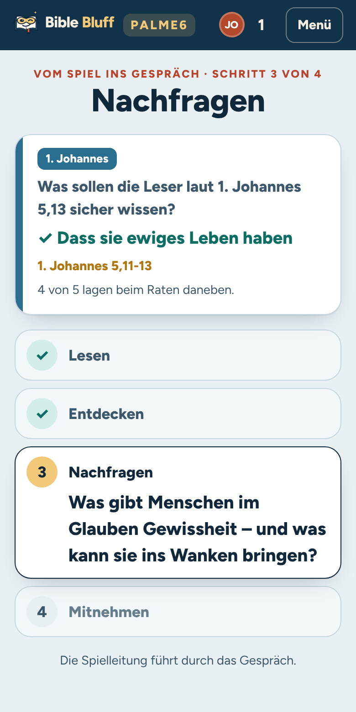 | 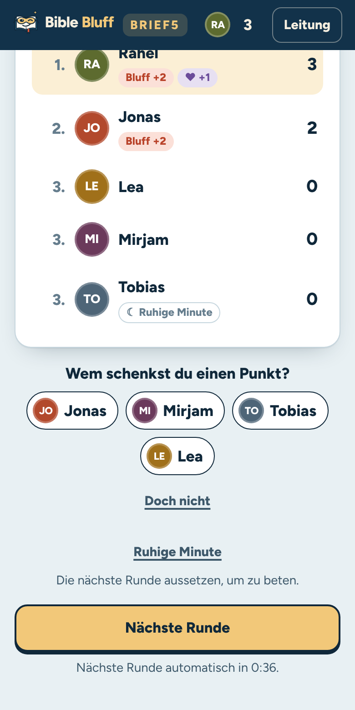 | 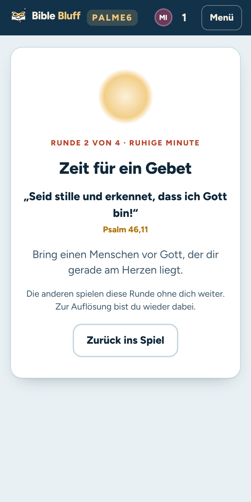 |

Leinwand-Ansicht (`/tv/RAUMCODE`):


## So läuft eine Partie

1. **Raum eröffnen.** Die Spielleitung wählt Rundenzahl (4–12, Standard 8), Schwierigkeit (leicht, mittel, schwer, gemischt) und die Zeitlimits. Sie spielt mit oder leitet nur, etwa am Beamer.
2. **Beitreten.** Alle scannen den QR-Code oder geben den Raumcode (z. B. `LAMPE7`) und einen Spitznamen ein. Konten gibt es nicht.
3. **Gemeinsam starten.** Dieselbe Runde beginnt auf allen Handys.

| Phase | Was passiert |
| --- | --- |
| Bluff schreiben (45–120 s) | Alle erfinden heimlich eine falsche Antwort. Wer keine Idee hat, nimmt einen vorbereiteten Vorschlag, einen pro Runde. |
| Abstimmen (20–60 s) | Die Wahrheit steht anonym und gemischt zwischen den Bluffs. Den eigenen Bluff kann man nicht wählen. |
| Aufdecken | Synchron auf allen Geräten: Wer hat was gewählt? Wer hat es erfunden? Am Ende kommt der Stempel „Wahr!“. |
| Punkte & Entdeckung | Die Bibelstelle, ein überraschender Satz zur Auflösung und der Punktestand. Alle verteilen ein Herz an ihren Lieblingsbluff, und wer mag, verschenkt einen Punkt. |

**Punkte:** +2 für das Erkennen der richtigen Antwort, +1 für jede Person, die auf den eigenen Bluff hereinfällt, +1 für den Lieblingsbluff der Runde.

Dadurch kann auch jemand mit wenig Bibelwissen gewinnen, denn gute Einfälle und Menschenkenntnis zählen mit. Am Ende gibt es ein Siegertreppchen und fünf Auszeichnungen (Bluff-Meister, Wahrheitsfinder, Gutgläubigste Seele, Bester Bluff des Abends, Nächstenliebe). Außerdem zeigt der Endstand alle Entdeckungen der Partie zum Nachlesen, und die Leitung kann direkt ins Gespräch überleiten.

### Lieblingsbluff

Nach der Auflösung zeigt jedes Handy die Bluffs der Runde mit ihren Urhebern. Jede Person verteilt ein Herz an den Bluff, der ihr am besten gefallen hat. Nochmal tippen nimmt das Herz zurück, ein anderer Bluff bekommt es stattdessen. Für den eigenen Bluff gibt es kein Herz. Der Bluff mit den meisten Herzen bringt seinen Urhebern +1 Punkt, bei Gleichstand allen führenden. Der Punkt erscheint sofort im Punktestand und wird beim Weiterschalten gutgeschrieben. Im Endstand kürt das Spiel den **Besten Bluff des Abends**: den Bluff mit den meisten Herzen in einer Runde, im Wortlaut.

### Entdeckungen zum Mitnehmen

Nach der letzten Runde legt das Spiel eine dauerhafte Seite unter `/e/ID` an. Sie zeigt alle Fragen der Partie mit Antwort, Bibelstelle, Entdeckung und dem Lieblingsbluff jeder Runde. Auf den Handys steht im Endstand „Entdeckungen teilen“ (Teilen-Dialog oder Link kopieren), die Leinwand zeigt oben rechts einen QR-Code. Die Seite enthält keine Namen und keinen Raumcode. Sie bleibt erhalten, auch wenn der Raum längst gelöscht ist, und eignet sich zum Nachlesen in der Woche oder für die nächste Kleingruppe.

### Liebe deinen Nächsten

In der Punkte-Phase verschenkt jede Person einmal pro Runde einen eigenen Punkt an jemanden, den sie auswählt. Der Punktestand zeigt das sofort („+1 von Rahel“, „−1 an Mirjam“), und wer beschenkt wird, bekommt einen Hinweis aufs Handy. Verschenken lässt sich nur, was man schon hat; der vorläufige Lieblingsbluff-Punkt zählt erst nach dem Weiterschalten. Wer am meisten verschenkt hat, bekommt im Endstand die Auszeichnung **Nächstenliebe**.

### Ruhige Minute

Wer eine Pause zum Beten braucht, tippt auf „Ruhige Minute“. Beim Schreiben oder Abstimmen setzt die Person die laufende Runde aus, nach der Auflösung die nächste. Das Spiel wartet nicht auf sie, ein schon geschriebener Bluff oder eine Stimme wird zurückgenommen. Ihr Handy zeigt stattdessen eine ruhige Seite mit einem Psalmvers und einem kurzen Gebetsimpuls; die anderen sehen nur ein ☾ neben dem Namen. „Zurück ins Spiel“ geht jederzeit, spätestens zur nächsten Runde ist sie automatisch wieder dabei.

### Vom Spiel ins Gespräch

Zu jeder der 186 Fragen gibt es einen **Spickzettel** mit Hintergrundwissen, einer offenen Gesprächsfrage und einem Querverweis auf eine andere Bibelstelle. Er erscheint nach jeder Auflösung nur auf dem Gerät der Spielleitung (am Beamer zunächst zugeklappt).

Nach dem Endstand führt „Weiter ins Gespräch“ zu der Frage, bei der die meisten danebenlagen; jede andere Frage der Partie lässt sich ebenso wählen. Die Leitung blättert durch vier Schritte, und alle Handys und die Leinwand gehen mit:

1. **Lesen:** die Bibelstelle aufschlagen und laut vorlesen.
2. **Entdecken:** Was fällt auf, was hat überrascht? Dazu der Hintergrund vom Spickzettel.
3. **Nachfragen:** die Gesprächsfrage zur Stelle.
4. **Mitnehmen:** Was nehmen wir mit, wofür danken oder beten wir? Dazu der Querverweis zum Weiterlesen.

So wird aus einem Spieleabend ein Hauskreis-Abend ohne Vorbereitung. Das Gespräch ist freiwillig: „Zurück zum Endstand“ beendet es jederzeit. Die Texte (`src/server/talk.ts`) sind mit KI-Hilfe geschrieben und gegengeprüft; Querverweise sind mit eigenen Worten wiedergegeben, ohne geschützte Bibelübersetzungen zu zitieren. Eine Durchsicht durch jemanden aus eurer Gemeinde lohnt sich trotzdem.

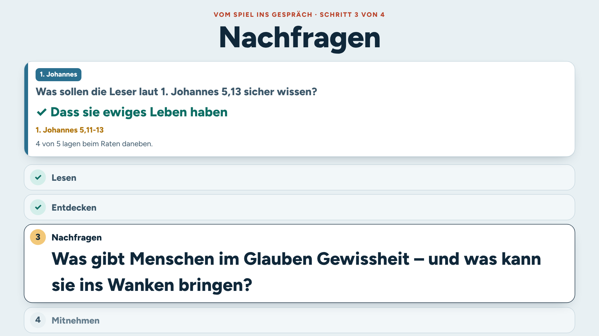

### Neues für alle

Bei einem Bluff-Spiel verdirbt eine bekannte Frage die Runde: Wer die Antwort noch weiß, tippt sofort richtig. Darum merkt sich jedes Handy, welche Fragen es schon aufgelöst gesehen hat (nur die Frage-IDs, nur auf dem Gerät), und meldet sie beim Eröffnen oder Beitreten. Der Server zählt pro Raum, wie viele Leute eine Frage kennen, und zieht zuerst Fragen, die niemand kennt, dann die, die am wenigsten Leute kennen. Die Lobby zeigt, wie viele Fragen „für alle neu“ sind.

### Frische Hausbluffs

Jede Frage hat drei vorbereitete Hausbluffs, die auch der Vorschlagsknopf liefert. Wer öfter spielt, erkennt sie irgendwann. Deshalb sammelt das Spiel nach jeder Partie Bluffs, die mindestens zwei Leute reingelegt oder zwei Herzen bekommen haben, als Kandidaten: ohne Namen, und ohne Bluffs, in denen ein Name aus dem Raum vorkommt.

Auf **`/admin`** prüfst du die Kandidaten, korrigierst bei Bedarf den Text und nimmst sie auf oder lehnst sie ab. Erst aufgenommene Bluffs ergänzen die Hausbluffs und Vorschläge ihrer Frage. Das Spiel lehnt ab, was zu nah an der richtigen Antwort liegt oder schon ein Hausbluff ist.

Die Seite braucht einen Schlüssel: Lege im Cloudflare-Dashboard unter **Workers & Pages → bible-bluff → Settings → Variables and Secrets** ein Secret `ADMIN_KEY` an, am besten eine lange Zufallsfolge. Ohne diesen Schlüssel ist die Freigabe abgeschaltet. Lokal geht es mit `ADMIN_KEY=… npm start`.

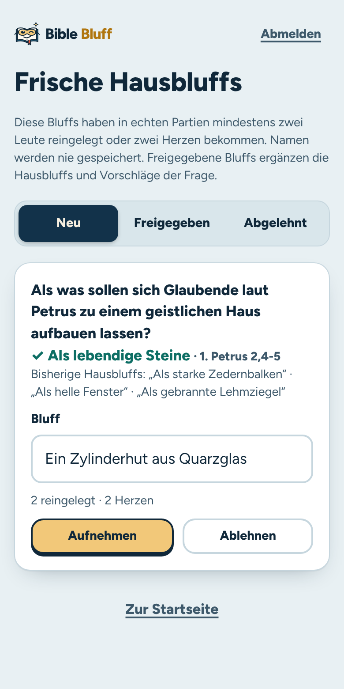

### Faire Runden

- **Versehentlich richtige Bluffs** werden abgelehnt („zu nah an der Wahrheit“). Jede Frage hat dafür hinterlegte Schlüsselwörter und Antwortvarianten, dazu kommt ein unscharfer Textvergleich. Zahlen werden dabei nicht verwechselt (400 ≠ 430).
- **Gleiche Bluffs** werden zusammengeführt, unabhängig von Groß- und Kleinschreibung, Füllwörtern, Wortreihenfolge und kleinen Tippfehlern. Fallen andere darauf herein, bekommen alle Urheber ihre Punkte.
- **Wenige Bluffs?** Dann füllt das Spiel mit vorbereiteten „Hausbluffs“ auf, damit immer mindestens vier Antworten zur Wahl stehen.
- **Geheimnisse bleiben auf dem Server.** Die richtige Antwort, die Urheber der Bluffs und die Stimmen gelangen erst mit der Aufdeckung zu den Handys. Die Fragen liegen nicht im Browser-Code.

### Für die Spielleitung

Das Menü „Leitung“ bietet:
- Pausieren und Fortsetzen (alle Zeitlimits stehen still)
- eine Phase vorzeitig beenden
- eine Frage tauschen oder die Aufdeckung beschleunigen
- den Raum für Neue sperren
- den Raum öffentlich auf der Startseite zeigen
- Teilnehmende entfernen
- die Spielleitung übergeben
- den Raum schließen

Die Spielleitung bleibt bei der Person, die den Raum eröffnet hat, auch wenn ihr Handy zwischendurch gesperrt ist oder sie kurz in eine andere App wechselt, etwa um den Code zu verschicken. Abgeben lässt sie sich nur bewusst über „Spielleitung übergeben“. Wer als Leitung das Gerät wechselt, gibt denselben Spitznamen wieder ein und leitet weiter. Die Punkte-Phase läuft nach 40 Sekunden von selbst weiter.

### Öffentliche Räume

Wer keine eigene Gruppe hat, kann trotzdem mitspielen: Die Leitung kann ihren Raum im Warteraum oder im Menü „Leitung“ öffentlich zeigen. Dann steht er auf der Startseite unter „Offene Räume“, und alle können mit einem Tipp beitreten, auch mitten in eine laufende Partie. Der Schalter ist zunächst immer aus.

- **Keine Namen auf der Startseite.** Die Liste zeigt nur Raumcode, Zahl der Personen, Stand der Partie und Schwierigkeit. Spitznamen und anderer Freitext erscheinen dort nie, damit niemand Unpassendes auf die Startseite bringen kann.
- **Nur Räume, in denen wirklich gespielt wird.** Gesperrte, volle, beendete und geschlossene Räume fehlen, ebenso Räume, in denen gerade niemand verbunden ist.
- **Transparent für alle im Raum.** Mitspielende sehen im Warteraum, dass ihr Raum öffentlich ist.
- **Sparsam.** Die Startseite fragt alle 10 Sekunden nach, solange sie sichtbar ist, und der Worker hält die Liste 4 Sekunden vor. Die Liste erscheint nur, wenn es gerade offene Räume gibt.

### Verbindungsabbrüche

Jedes Handy merkt sich seine Sitzung. Neu laden, kurz das WLAN verlieren oder den Bildschirm sperren kostet nichts. Wer das Gerät oder den Browser wechselt, gibt einfach denselben Spitznamen wieder ein und steigt am alten Platz wieder ein, solange das alte Gerät nicht mehr verbunden ist. Während der Partie bleibt der Bildschirm wach, sofern der Browser das unterstützt. Ein fertiger, aber noch nicht abgeschickter Bluff wird kurz vor Ablauf der Zeit automatisch abgegeben.

## Loslegen

Voraussetzung ist Node.js 20 oder neuer.

```bash
npm install
npm run dev          # http://localhost:5173 – App mit eingebauter API (Räume im Arbeitsspeicher)
```

### Spieleabend ohne Cloud (eigenes WLAN)

```bash
npm run build
npm start            # zeigt die Adresse im WLAN an, z. B. http://192.168.0.23:8787
```

Alle Handys im selben WLAN öffnen diese Adresse. Am besten eröffnet die Spielleitung den Raum über die WLAN-Adresse, dann zeigt auch der QR-Code dorthin. Die Räume liegen im Arbeitsspeicher und verschwinden beim Beenden.

### Veröffentlichen auf Cloudflare (Workers + D1)

Die D1-Datenbank `bible-bluff` (Region Westeuropa) ist angelegt, das Schema ist eingespielt, und ihre ID steht in `wrangler.toml`. `npx wrangler deploy` baut die App selbst (`[build]` in `wrangler.toml`) und veröffentlicht Worker und Assets.

**Empfohlen: automatisch bei jedem Push auf `main` (Workers Builds).** Im Cloudflare-Dashboard unter **Workers & Pages → bible-bluff → Settings → Builds → Connect** das GitHub-Repository `roruffm/bible-bluff` mit dem Branch `main` verbinden. Die Voreinstellungen passen: kein Build-Befehl nötig, Deploy-Befehl `npx wrangler deploy`. Danach löst jeder Merge in `main` die Veröffentlichung aus.

**Oder von Hand:**

```bash
npx wrangler login
npm run db:migrate:remote                 # neue Migrationen einspielen (aktuell bis 0004_listed_rooms)
npm run deploy                            # baut die App und veröffentlicht Worker + Assets
```

**Vorschauen je Pull-Request:** Workers Builds baut zu jedem Pull-Request eine Vorschau mit eigener URL (`wrangler preview`). Vorschauen nutzen eine eigene Datenbank `bible-bluff-preview` (Block `previews` in `wrangler.toml`), damit Tests nie Räume der Produktion berühren. Neue Migrationen müssen deshalb in beide Datenbanken: `npm run db:migrate:remote` für die Produktion und `npx wrangler d1 execute bible-bluff-preview --remote --file migrations/<datei>.sql` für die Vorschau.

Die Tabellen `recaps` (Entdeckungen-Seiten) und `bluff_pool` (frische Hausbluffs) sowie den Index für öffentliche Räume legt der Worker beim ersten Bedarf auch selbst an. Fehlt eine Migration in einer Datenbank, funktioniert trotzdem alles.

Für ein anderes Cloudflare-Konto zuerst `npx wrangler d1 create bible-bluff` und `npx wrangler d1 create bible-bluff-preview` ausführen und beide `database_id`-Werte in `wrangler.toml` eintragen.

Lokal lässt sich der echte Worker mit D1 so testen: `npm run dev:cf` (Port 8787).

## Technik

```
Handys / Leinwand ──(etwa jede Sekunde: GET /api/rooms/CODE)──▶ Cloudflare Worker ──▶ D1
                  ◀── persönliche, gefilterte Sicht ──────────┘   rooms (JSON + Version)
                  ──(POST /api/rooms/CODE/action)─────────────▶   presence (zuletzt gesehen)
Endstand          ──(POST /api/rooms/CODE/recap)──────────────▶   recaps (Entdeckungen-Seiten)
Seite /e/ID       ──(GET /api/recaps/ID)──────────────────────▶
Startseite        ──(GET /api/rooms, offene Räume)────────────▶   rooms (nur öffentlich gezeigte)
Freigabe /admin   ──(GET/POST /api/admin/bluffs, ADMIN_KEY)───▶   bluff_pool (Kandidaten, freigegebene Bluffs)
```

- **Server entscheidet alles.** Zeitlimits, Phasenwechsel, Duplikat-Erkennung und Punkte werden zentral berechnet. Phasen schalten „im Vorbeigehen“ weiter, also bei der nächsten Anfrage nach Ablauf der Frist oder sobald alle Verbundenen abgegeben haben. So braucht es weder Cron noch Dauerprozess.
- **Optimistische Sperre.** Der Raumzustand liegt als JSON mit Versionsnummer in D1. Ein Update gilt nur, wenn niemand dazwischen geschrieben hat; sonst wird neu gelesen und wiederholt. Getestet ist das mit zwölf gleichzeitigen Abgaben gegen lokale D1.
- **Synchrone Aufdeckung.** Der Server legt Ablauf und Startzeit fest. Jedes Gerät gleicht seine Uhr mit dem Server ab und rechnet den aktuellen Schritt selbst aus. Darum stehen alle Handys im selben Moment beim selben Bluff.
- **Präsenz** wird gedrosselt in einer eigenen Tabelle festgehalten (höchstens alle 5 s pro Gerät). Sie bestimmt, auf wen gewartet wird.
- **Spiel-Engine als reine Funktionen** (`src/server/engine.ts`): Zeit, Zufall und Präsenz kommen von außen. Das macht sie vollständig testbar. Dieselbe API läuft im Worker, im Vite-Dev-Server und im lokalen Node-Server.
- **Frontend:** Preact und Vite, etwa 25 kB JavaScript (gzip). Die Schrift Figtree ist selbst gehostet, es gibt keine externen Dienste und keine Cookies. Das Design ist an die Lernblätter angelehnt: Papier, Dunkelbraun, Gold und die Farben der Buchgruppen.

### Kosten und Grenzen

Eine Partie mit 12 Handys erzeugt rund 40 000 Anfragen pro Stunde (in der Lobby und während der Aufdeckung weniger). Der kostenlose Workers-Tarif erlaubt 100 000 Anfragen pro Tag, also gut zwei Stunden Spiel mit voller Besetzung. Für regelmäßige Spieleabende empfiehlt sich Workers Paid (5 $/Monat, 10 Mio. Anfragen) oder der lokale Server. Die Preise bitte vor der Entscheidung in der aktuellen Cloudflare-Preisliste prüfen. Als nächster Ausbauschritt bieten sich Durable Objects mit WebSockets an: Sie ersetzen das Abfragen und senken die Last deutlich.

Räume werden 24 Stunden nach der letzten Änderung gelöscht. Entdeckungen-Seiten bleiben dauerhaft; jede ist nur wenige Kilobyte groß.

### Farben

Jede Person wählt auf der Startseite oder im Menü ihr eigenes Farbkonzept. Die Wahl gilt nur auf diesem Gerät und bleibt gespeichert. Wer nichts wählt, sieht See Genezareth.

| Farbkonzept | Wirkung |
| --- | --- |
| See Genezareth (Standard) | Tiefes Blau, Türkis und Sand. |
| Lernblatt | Warmes Papier, Dunkelbraun und Gold wie die Lernblätter. Folgt Hell und Dunkel des Geräts. |
| Nachtquiz | Dunkel mit Neonfarben wie in einer Quizshow. Am stärksten auf dem Beamer im abgedunkelten Raum. |
| Spieltisch | Filzgrün, Kartenrot und Chipgold auf hellem Leinen. |
| Comic | Sonnengelb, Schwarz und Pink mit harten Schatten. |
| Klar | Viel Weiß, Indigo und Koralle. Schlicht und gut lesbar. |

Der Link „Leinwand-Ansicht öffnen“ nimmt das Farbkonzept der Spielleitung mit (`/tv/RAUMCODE?farbe=nacht`).

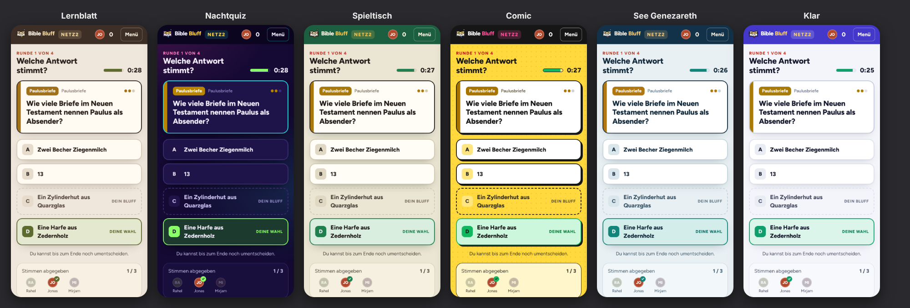

Technisch setzt jedes Konzept nur CSS-Variablen (`html[data-theme]` am Ende von `src/client/styles.css`). Lernblatt steht direkt in `:root` und braucht kein `data-theme`. Namen, Vorschaufarben und der Standard stehen in `src/client/lib/theme.ts`.

## Logo

Die Bildmarke liegt als SVG in `src/client/public/logo.svg`: eine aufgeschlagene Bibel mit Maskenbrille, die verschmitzt zwinkert. In der App ist sie als Komponente `LogoMark` eingebaut; im großen Logo funkelt der Stern, und das Auge blinzelt ab und zu. Ihre Farben passen sich dem gewählten Farbkonzept an. Favicon und Homescreen-Icons entstehen aus der Bildmarke mit `node scripts/render-icons.mjs`.

## Impressum und Datenschutz

Unter `/impressum` und `/datenschutz` stehen Impressum und Datenschutzerklärung. Links darauf gibt es auf der Startseite, beim Raum-Eröffnen, beim Beitreten, auf den Entdeckungen-Seiten und im Menü eines Raums (dort in einem neuen Tab, damit niemand aus der Partie fällt). Name, Anschrift und E-Mail stehen an einer Stelle in `src/client/screens/Legal.tsx` (`ANBIETER`). Ändert sich etwas daran, was das Spiel speichert, gehört die Datenschutzerklärung in derselben Datei mit angepasst.

## Fragen ergänzen

Die Fragen stehen in `src/server/questions.ts`. Jede Frage hat folgende Felder:

```ts
{
  id: '2tim-mantel',
  book: '2. Timotheus',
  group: 'pastoral',                 // Farbe der Buchgruppe; 'at' für das Alte Testament
  difficulty: 2,                     // 1 leicht · 2 mittel · 3 schwer
  prompt: 'Was sollte Timotheus Paulus mitbringen?',
  answer: 'Einen Mantel, Bücher und Pergamente',     // im Stil eines Bluffs: kurz, ohne Klammern
  accept: [['mantel'], ['pergament'], ['*buecher']], // Schlüsselwörter für „zu nah an der Wahrheit“
  bluffs: ['Brot, Öl und neue Sandalen', /* … */],    // Vorschläge und Hausbluffs
  ref: '2. Timotheus 4,13',
  discovery: 'Auch Paulus brauchte warme Kleidung und Lesestoff. …',
}
```

Schlüsselwörter werden ohne Umlaute geschrieben (`ae`, `oe`, `ue`, `ss`). Ein Wort ohne Zeichen muss am Wortanfang passen, `*wort` darf irgendwo im Wort stehen, `=wort` muss genau so lauten. Mehrere Wörter in einer Gruppe müssen alle vorkommen. Die Tests prüfen jede Frage automatisch: Die Antwort selbst muss erkannt werden, die vorbereiteten Bluffs dürfen nicht anschlagen.

## Tests

```bash
npm run typecheck
npm test             # Engine, Textvergleich, Fragenpool, Gesprächsstoff, API, Freigabe (Vitest)
npm run test:e2e     # komplette Partien mit mehreren Browsern (Playwright)
```

## Projektstruktur

```
src/
  shared/      Typen und Regeln, die Server und Browser teilen
  server/      Engine, Fragenpool, Textvergleich, API, D1-/Speicher-Anbindung
  worker.ts    Cloudflare-Worker-Einstieg
  client/      Preact-App (Startseite, Lobby, Phasen, Aufdeckung, Leinwand)
migrations/    D1-Schema
scripts/       lokaler Node-Server
tests/ e2e/    Unit- und End-to-End-Tests
```
